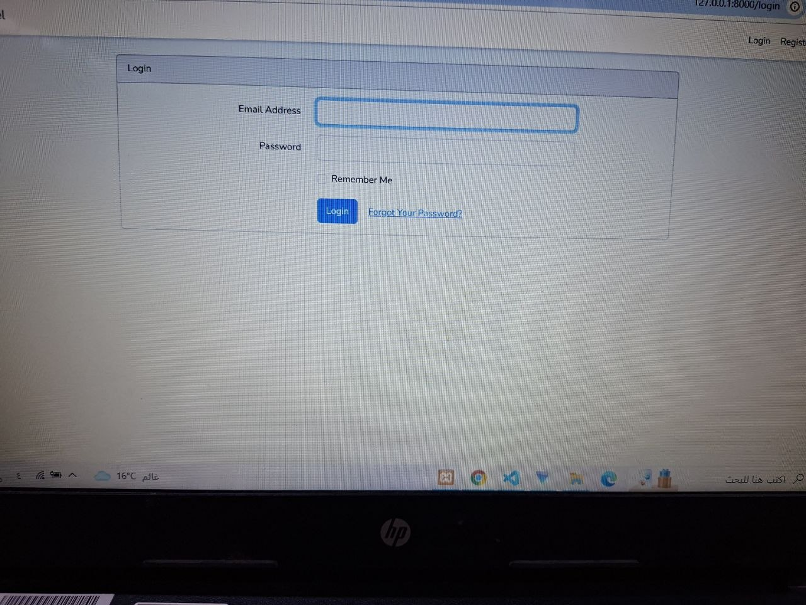
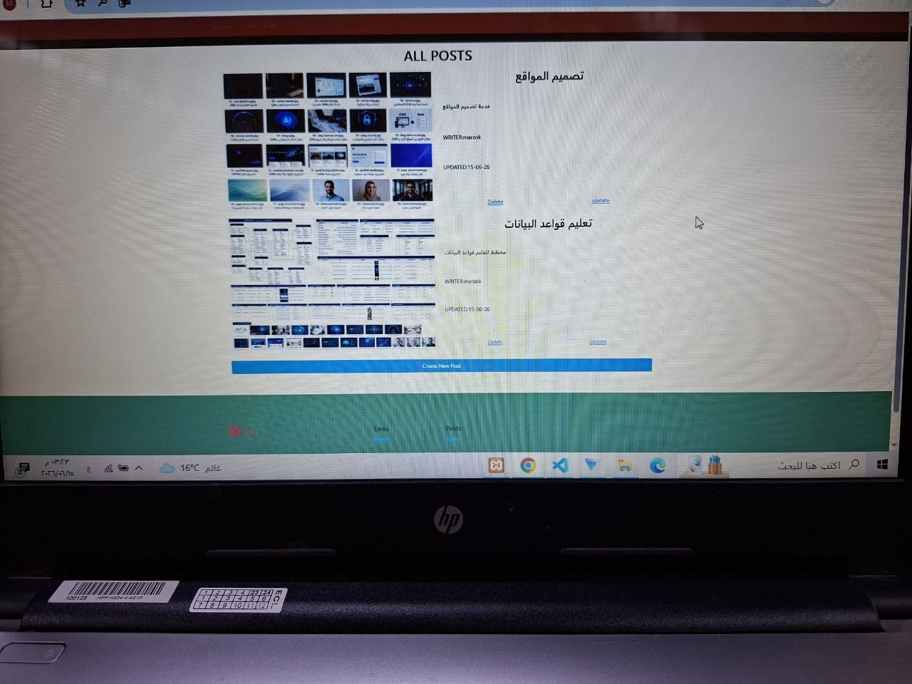
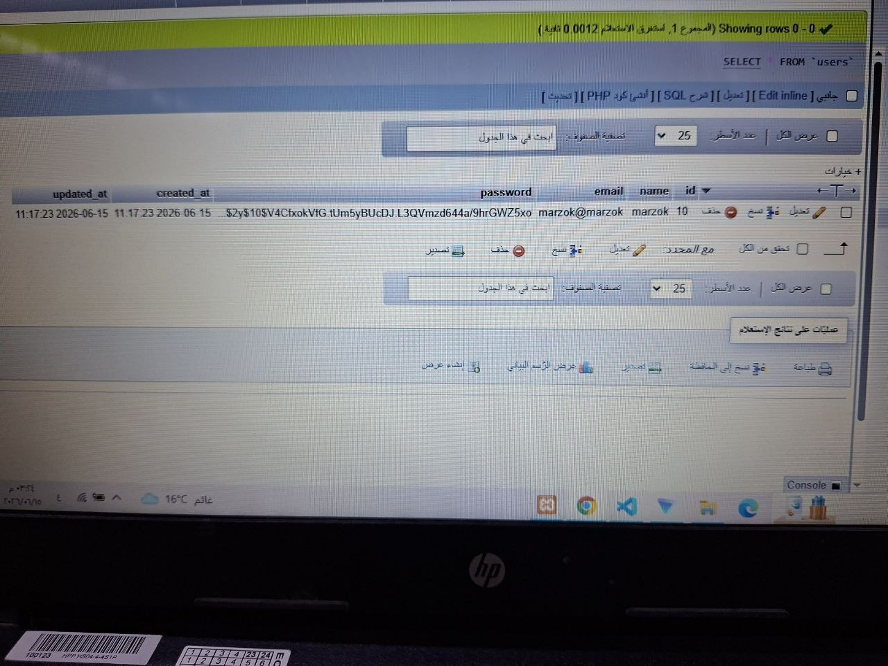

# Arabic Blog

A simple blog management system built with Laravel.

## Overview

Arabic Blog is a web application that allows users to manage blog posts through a clean and simple interface. The project was developed as a practical Laravel learning project focusing on authentication, CRUD operations, file uploads, routing, controllers, and database management.

---

## Features

### Authentication
- User Login
- User Registration
- Session Management
- Protected Routes

### Posts Management
- Create Posts
- Edit Posts
- Delete Posts
- View Posts
- Upload Post Images

### Users Management
- Create Users
- Edit Users
- Delete Users
- View User Information

### General Features
- Responsive Bootstrap Interface
- Laravel Authentication System
- File Upload Handling
- Form Validation
- MySQL Database Integration

---

## Technologies Used

- PHP
- Laravel
- MySQL
- Bootstrap
- Blade Templates
- Vite

---

## Project Structure

```text
app/
├── Http/
│   ├── Controllers/
│   └── Middleware/
├── Models/

database/
├── migrations/
├── seeders/

resources/
├── views/

routes/
├── web.php
```

---

## Installation

Clone the repository:

```bash
https://github.com/Marzokajaj/arabic-blog.git```

Move to the project directory:

```bash
cd arabic-blog
```

Install dependencies:

```bash
composer install

npm install
```

Create environment file:

```bash
cp .env.example .env
```

Generate application key:

```bash
php artisan key:generate
```

Configure database settings inside:

```env
DB_DATABASE=
DB_USERNAME=
DB_PASSWORD=
```

Run migrations:

```bash
php artisan migrate
```

Start development server:

```bash
php artisan serve
```

Compile frontend assets:

```bash
npm run dev
```

---

## Learning Objectives

This project was created to practice:

- Laravel MVC Architecture
- Authentication System
- CRUD Operations
- Database Relationships
- File Uploads
- Route Management
- Middleware Usage
- Blade Templating

---

## Future Improvements

- Role & Permission System
- Rich Text Editor
- Categories & Tags
- Search Functionality
- REST API
- Comments System
- Dashboard Statistics

---

## Screenshots

### Login Page


### Posts List


### Create Post


### Database List



## Author

Marzok Ajaj

Electronics & Communications Engineer

Laravel Developer

GitHub:
https://github.com/Marzokajaj
